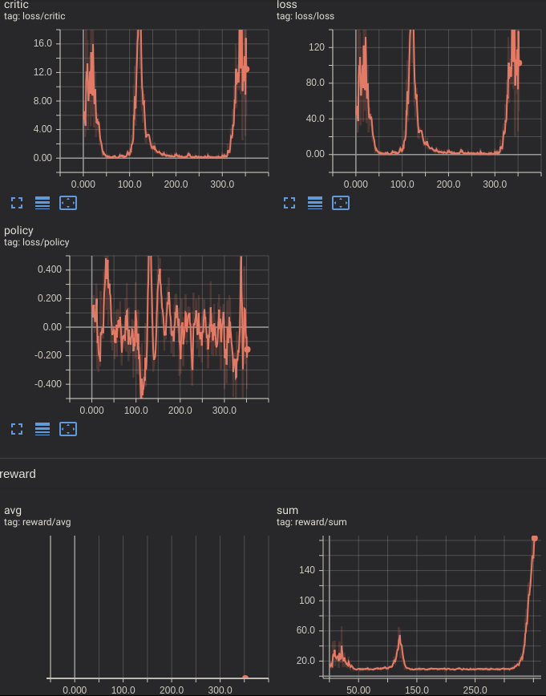

# Simple Pytorch PPO

This repository feature a minimalist PPO model capable of solving 'CartPole-v0' gym environment. The model is written in pytorch and use tensorboardX.



This model is made to be very simple and requires many improvement to reach state of the art ppo results such as:

- A better neural network
- Batching
- Entropy bonus

## Train & Run

This project require python3.5+ torch, gym and tensorboardX.

```bash
python main.py #train the model
python run.py #display an episode
python train_n_search.py #search hyperparameters
```

Use -h to learn more about the options.